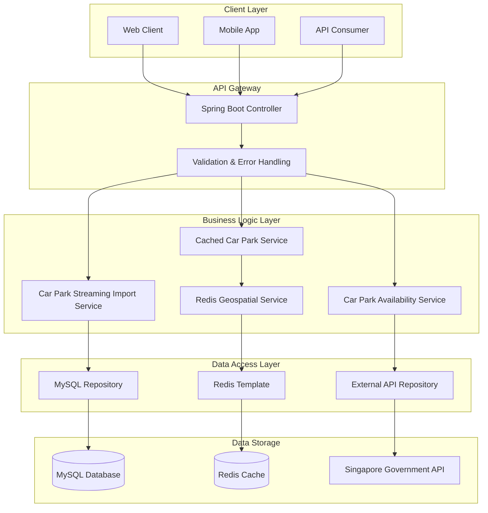
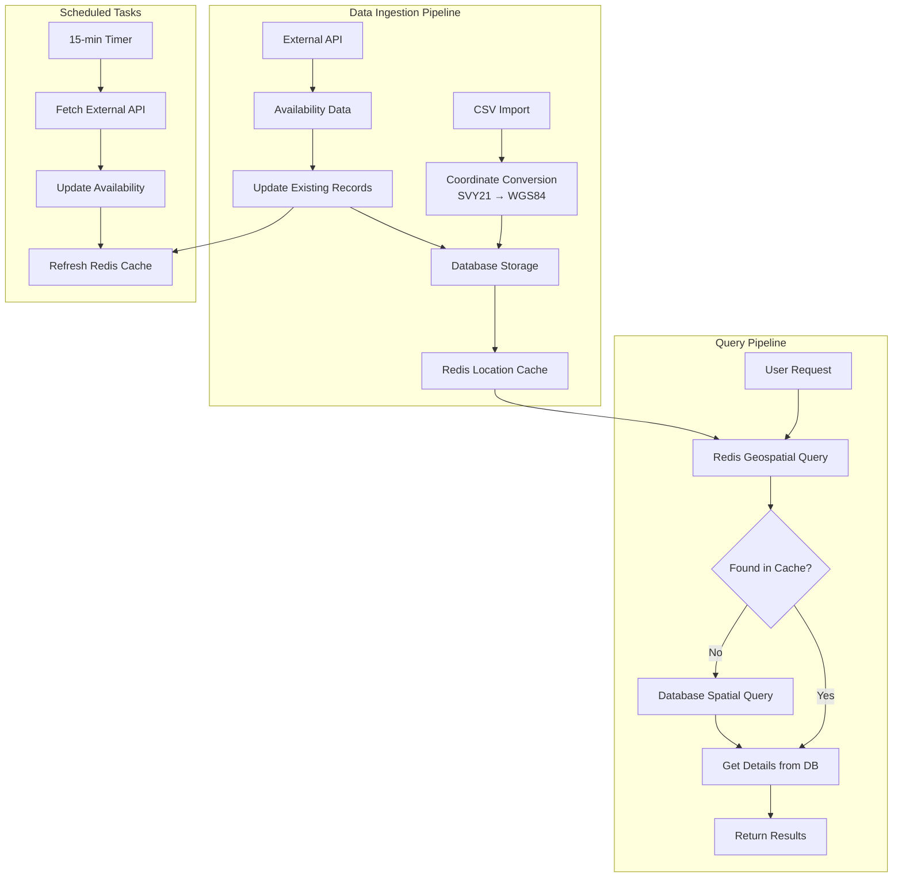
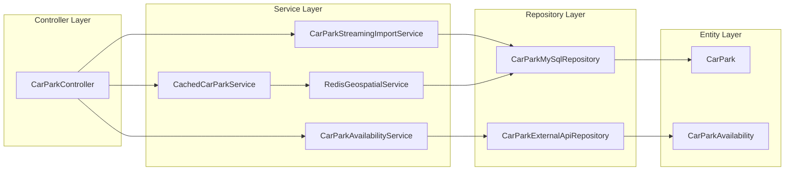
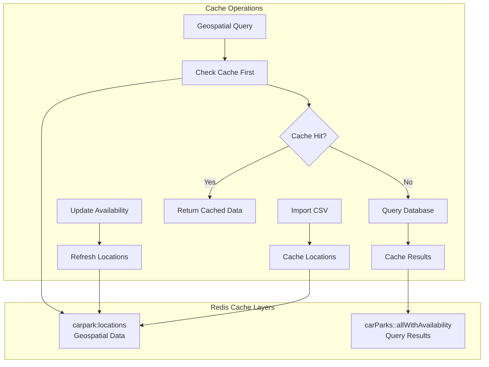
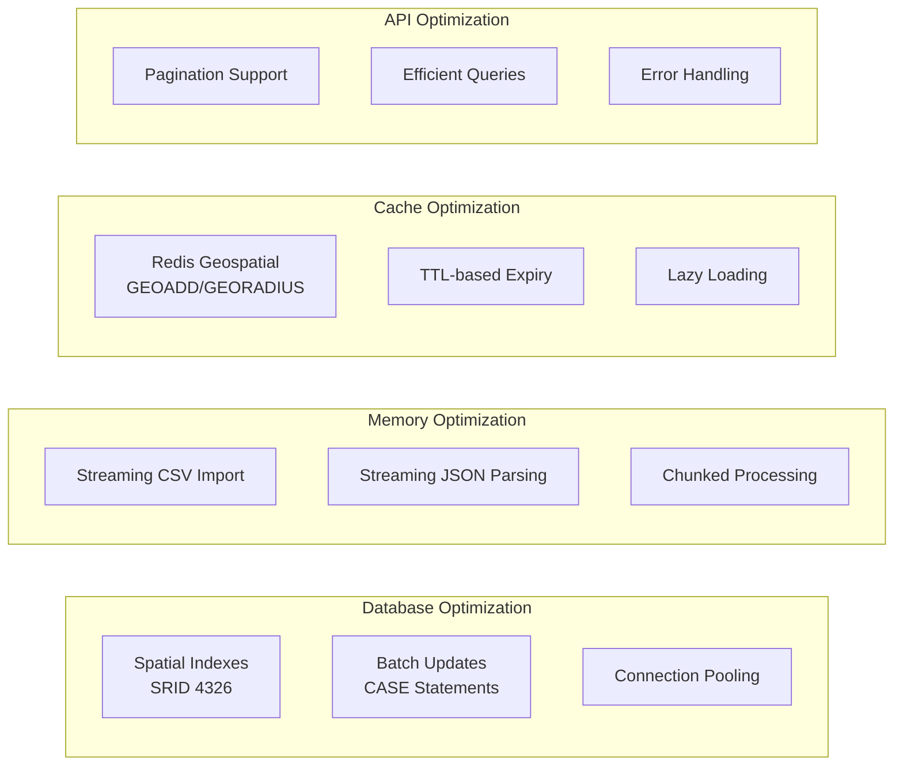
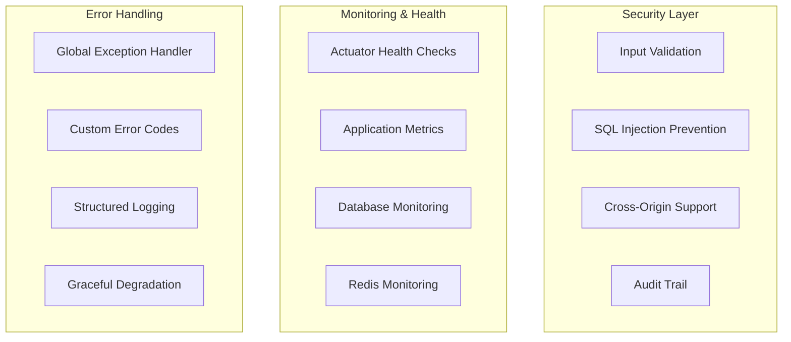

# Car Park API Application

Application that finds the nearest car parks to a user's location with availability information using Singapore government data.

## Features
- **Nearest Car Park Search**: Find car parks near a given location with availability information
- **Audit Fields**: Track creation, updates, and soft deletes with user attribution
- **Real-time Availability**: Automatic updates from Singapore government API every 15 minutes
- **Coordinate Conversion**: Converts SVY21 coordinates to WGS84 (latitude/longitude) format
- **Pagination Support**: Efficient pagination for large result sets
- **RESTful API**: Clean REST endpoints with proper validation and error handling
- **Docker Support**: Complete containerization with MySQL, Redis, and Spring Boot

## Architecture Design

The application follows a layered architecture pattern with clear separation of concerns, optimized for performance and scalability.

### System Overview


### Data Flow Architecture



### Component Architecture



### Database Schema Design

```mermaid
erDiagram
    CarPark {
        string car_park_no PK
        string address
        decimal latitude
        decimal longitude
        point location SRID4326
        int total_lots
        int available_lots
        string car_park_type
        string type_of_parking_system
        string short_term_parking
        string free_parking
        string night_parking
        string car_park_decks
        string gantry_height
        string car_park_basement
        string created_by
        datetime created_at
        string updated_by
        datetime updated_at
        datetime deleted_at
    }

    CarParkAvailability {
        string carpark_number PK
        int total_lots
        int available_lots
        string lot_type
    }

    CarPark ||--|| CarParkAvailability : "availability_data"
```

### Caching Strategy



### Performance Optimization Features



### Security & Monitoring



### Key Architectural Decisions

#### **Layered Architecture**
- **Controller Layer**: Handles HTTP requests, validation, and error handling
- **Service Layer**: Contains business logic and orchestrates operations
- **Repository Layer**: Manages data access and external API interactions
- **Entity Layer**: Defines data models and relationships

#### **Caching Strategy**
- **Redis Geospatial**: Stores car park locations for fast spatial queries
- **TTL-based Expiry**: Automatically refreshes cache every 15 minutes
- **Fallback Mechanism**: Database queries when cache misses occur

#### **Performance Optimizations**
- **Streaming Processing**: Handles large CSV and JSON files without memory issues
- **Batch Operations**: Uses native SQL CASE statements for efficient updates
- **Spatial Indexing**: MySQL spatial indexes (SRID 4326) for location queries
- **Connection Pooling**: Efficient database connection management

#### **Data Flow Design**
- **CSV Import**: Establishes car park structure and coordinates
- **External API**: Updates availability data for existing car parks
- **Real-time Updates**: Scheduled tasks ensure data freshness
- **Coordinate Conversion**: Accurate SVY21 to WGS84 transformation

#### **Scalability Considerations**
- **Horizontal Scaling**: Stateless services can be replicated
- **Database Optimization**: Efficient queries and indexing strategies
- **Cache Distribution**: Redis cluster support for high availability
- **Async Processing**: Non-blocking operations for better throughput

## Quick Start

### Option 1: Docker Compose (Recommended)

The easiest way to get started is using Docker Compose, which will set up the entire environment including MySQL, Redis, and the Spring Boot application.

#### Prerequisites
- Docker Desktop installed and running
- At least 4GB of available RAM
- Ports 8080, 21308, and 21703 available on your machine

#### Steps

1. **Clone and Navigate**
   ```bash
   git clone <repository-url>
   cd SpringBootStarter
   ```

2. **Start the Complete Stack**
   ```bash
   # Build and start all services
   docker compose up --build -d

   # Check status
   docker compose ps
   ```

3. **Verify Services**
   ```bash
   # Check if all containers are healthy
   docker compose ps

   # View logs
   docker compose logs -f
   ```

4. **Test the Application**
   ```bash
   # Health check
   curl http://localhost:8080/actuator/health
   ```

#### Docker Compose Services

- **MySQL**: Port 21308 (external) → 3306 (internal)
- **Redis**: Port 21703 (external) → 6379 (internal)
- **Spring Boot App**: Port 8080

#### Useful Docker Commands

```bash
# View logs for specific service
docker compose logs carpark-api
docker compose logs mysql
docker compose logs redis

# Restart a specific service
docker compose restart carpark-api

# Stop all services
docker compose down

# Stop and remove volumes (WARNING: This will delete all data)
docker compose down -v

# View resource usage
docker stats
```

### Option 2: Local Development Environment

If you prefer to run the application locally without Docker, follow these steps.

#### Prerequisites
- Java 21 (OpenJDK or Oracle JDK)
- MySQL 8.0+
- Redis 7+
- Gradle 8.5+
- Maven (optional, for dependency management)

#### Database Setup

1. **Install MySQL**
   ```bash
   # macOS (using Homebrew)
   brew install mysql
   brew services start mysql

   # Ubuntu/Debian
   sudo apt update
   sudo apt install mysql-server
   sudo systemctl start mysql

   # Windows: Download MySQL Installer from official website
   ```

2. **Create Database and User**
   ```sql
   CREATE DATABASE carpark_db;
   CREATE USER 'carpark_user'@'localhost' IDENTIFIED BY 'carpark_password';
   GRANT ALL PRIVILEGES ON carpark_db.* TO 'carpark_user'@'localhost';
   FLUSH PRIVILEGES;
   ```

3. **Install Redis**
   ```bash
   # macOS
   brew install redis
   brew services start redis

   # Ubuntu/Debian
   sudo apt install redis-server
   sudo systemctl start redis

   # Windows: Download Redis for Windows or use WSL
   ```

#### Application Configuration

1. **Update application.properties**
   ```properties
   # Database Configuration
   spring.datasource.url=jdbc:mysql://localhost:3306/carpark_db?useSSL=false&serverTimezone=UTC&allowPublicKeyRetrieval=true
   spring.datasource.username=carpark_user
   spring.datasource.password=carpark_password

   # Redis Configuration
   spring.data.redis.host=127.0.0.1
   spring.data.redis.port=6379
   ```

2. **Run the Application**
   ```bash
   # Using Gradle
   ./gradlew bootRun

   # Or build and run JAR
   ./gradlew build
   java -jar build/libs/carpark-0.0.1-SNAPSHOT.jar
   ```

#### Development Workflow

1. **Start Services**
   ```bash
   # Terminal 1: Start MySQL
   mysql.server start

   # Terminal 2: Start Redis
   redis-server

   # Terminal 3: Run Spring Boot
   ./gradlew bootRun
   ```

2. **Import Initial Data**
   ```bash
   # Import car park data from CSV
   curl -X POST "http://localhost:8080/v1/carparks/import"
   ```

3. **Test Endpoints**
   ```bash
   # Test nearest car parks
   curl "http://localhost:8080/v1/carparks/nearest?latitude=1.234&longitude=103.456&page=1&per_page=5"

   # Update availability
   curl -X POST "http://localhost:8080/v1/carparks/update-availability"
   ```

##  Database Schema
### Carpark data
Place the Singapore car park CSV file in `data/carpark-data.csv` with the following format:
```csv
car_park_no,address,x_coord,y_coord,car_park_type,type_of_parking_system,short_term_parking,free_parking,night_parking,car_park_decks,gantry_height,car_park_basement
A1,BLK 1/2 TANJONG PAGAR PLAZA,26076.1487,48187.2034,SURFACE CAR PARK,COUPON,WHOLE DAY,NO,YES,0,0,0
```

## API Endpoints
```bash
# Find nearest car parks
curl -X GET "http://localhost:8080/v1/carparks/nearest" \
  -H "Content-Type: application/json" \
  -d '{
    "latitude": 1.234,
    "longitude": 103.456,
    "page": 1,
    "per_page": 10
  }'

# Import car park data
curl -X POST "http://localhost:8080/v1/carparks/import"

# Update availability
curl -X POST "http://localhost:8080/v1/carparks/update-availability"
```
## Scalability & Performance

The application is designed with scalability and performance in mind, implementing several key optimizations to ensure efficient data access and system performance.
### Database Spatial Indexing

The system leverages MySQL's spatial indexing capabilities to optimize location-based queries:

- **Spatial Data Types**: Uses `POINT SRID 4326` for storing car park coordinates in WGS84 format
- **Spatial Indexes**: Implements spatial indexes on the `location` field for fast geospatial queries
- **Optimized Queries**: Utilizes `ST_Distance_Sphere()` function for accurate distance calculations with indexed spatial data
- **Performance Impact**: Spatial queries that would take seconds without indexing now execute in milliseconds

```sql
-- Example of optimized spatial query with indexing
SELECT cp.*, ST_Distance_Sphere(?, cp.location) / 1000 AS distance_km
FROM car_parks cp
WHERE cp.deleted_at IS NULL AND cp.available_lots > 0
ORDER BY distance_km
LIMIT ? OFFSET ?
```

### Redis-Based Caching

Redis serves as a high-performance caching layer, particularly leveraging its geospatial features:

- **Geospatial Caching**: Stores car park locations in Redis using `GEOADD` commands for ultra-fast spatial queries
- **Cache Strategy**: Implements a simplified caching approach using only `carpark:locations` key with 15-minute TTL
- **Read-Heavy Optimization**: Given the system performs frequent read operations (user queries) and periodic writes (every 15 minutes), Redis caching enables:
  - **Sub-millisecond response times** for location-based queries
  - **Reduced database load** during peak usage
  - **Scalable concurrent access** without database connection pressure
- **Fallback Mechanism**: Database acts as a reliable fallback when Redis data is unavailable
- **Automatic Refresh**: Cache is automatically refreshed every 15 minutes to maintain data consistency

```java
// Redis geospatial caching implementation
redisTemplate.opsForGeo().add(CAR_PARK_LOCATIONS_KEY,
    new Point(longitude, latitude), carParkNo);
```

### Data Ingestion with Streaming and Batching

The system employs efficient data processing strategies for both import and updates:

#### CSV Data Import
- **Streaming Processing**: Uses OpenCSV with streaming to handle large CSV files without loading entire content into memory
- **Batch Database Operations**: Processes data in chunks to minimize memory footprint
- **Coordinate Conversion**: Efficiently converts SVY21 coordinates to WGS84 using optimized mathematical algorithms

#### Real-time Availability Updates
- **HTTP Streaming**: Uses Spring WebFlux's reactive streams to process large API responses efficiently
- **Chunked Processing**: Processes external API responses in `DataBuffer` chunks to manage memory usage
- **True Batch Database Updates**: Implements native SQL CASE statements to update multiple car parks in a single database operation
- **Connection Pool Optimization**: Batching minimizes concurrent database connections, reducing pressure on the connection pool and preventing potential database bottlenecks
- **Memory Management**: Streaming approach prevents loading large API responses entirely into memory

```java
// Efficient streaming and batching example
request.retrieve()
    .bodyToFlux(DataBuffer.class)
    .reduce(new StringBuilder(), (sb, dataBuffer) -> {
        // Process data in chunks
        byte[] bytes = new byte[dataBuffer.readableByteCount()];
        dataBuffer.read(bytes);
        DataBufferUtils.release(dataBuffer);
        sb.append(new String(bytes, StandardCharsets.UTF_8));
        return sb;
    })
```

### Performance Metrics

The current implementation demonstrates good performance characteristics:

- **Data Processing**: 2,084 car parks processed in ~0.6 seconds
- **Cache Refresh**: 2,254 locations cached in ~0.375 seconds
- **Complete Update Cycle**: Full availability update cycle completes in under 1 second
- **Query Response**: Nearest car park queries return results in milliseconds
- **Memory Efficiency**: Processes 300KB+ API responses without memory issues
- **Database Operations**: True batch updates using native SQL CASE statements for maximum efficiency

### Scalability Features

- **Horizontal Scaling**: Application can be deployed across multiple instances
- **Database Connection Pooling**: Efficient connection management for high concurrent loads
- **Redis Cluster Support**: Can be extended to Redis cluster for higher availability
- **Asynchronous Processing**: Scheduled tasks don't block user request processing
- **Resource Management**: Automatic cleanup of database connections and Redis resources

### Key Architectural Decisions

#### **Layered Architecture**
- **Controller Layer**: Handles HTTP requests, validation, and error handling
- **Service Layer**: Contains business logic and orchestrates operations
- **Repository Layer**: Manages data access and external API interactions
- **Entity Layer**: Defines data models and relationships

#### **Caching Strategy**
- **Redis Geospatial**: Stores car park locations for fast spatial queries
- **TTL-based Expiry**: Automatically refreshes cache every 15 minutes
- **Fallback Mechanism**: Database queries when cache misses occur

#### **Performance Optimizations**
- **Streaming Processing**: Handles large CSV and JSON files without memory issues
- **Batch Operations**: Uses native SQL CASE statements for efficient updates
- **Spatial Indexing**: MySQL spatial indexes (SRID 4326) for location queries
- **Connection Pooling**: Efficient database connection management

#### **Data Flow Design**
- **CSV Import**: Establishes car park structure and coordinates
- **External API**: Updates availability data for existing car parks
- **Real-time Updates**: Scheduled tasks ensure data freshness
- **Coordinate Conversion**: Accurate SVY21 to WGS84 transformation

#### **Scalability Considerations**
- **Horizontal Scaling**: Stateless services can be replicated
- **Database Optimization**: Efficient queries and indexing strategies
- **Cache Distribution**: Redis cluster support for high availability
- **Async Processing**: Non-blocking operations for better throughput
